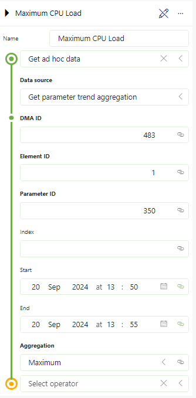
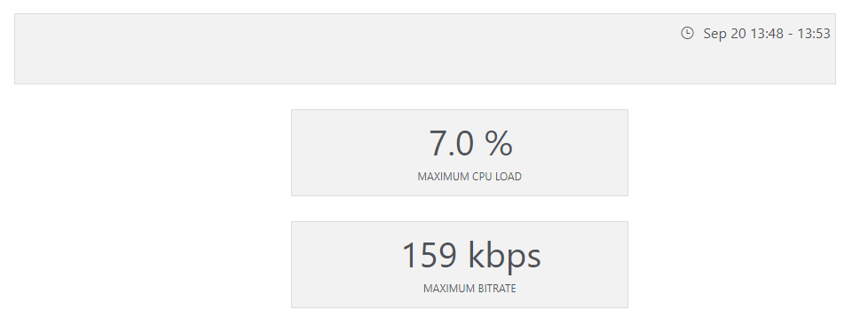

# Get parameter trend aggregation

Data sources that retrieves a maximum/average/minimum value for a trended parameter over a certain time period:

Ideally to be used with a time range filter and state components:

Does not support fetching aggregations for all entries in a table.
